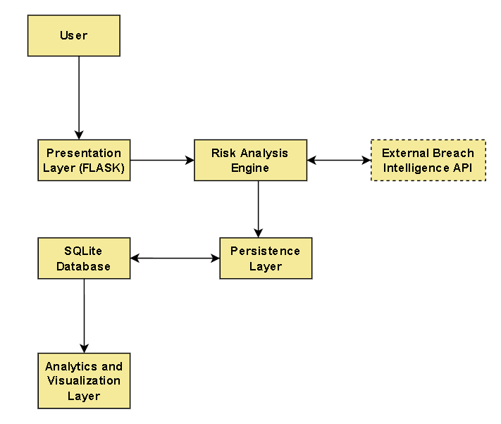

Advanced Password Risk Intelligence System

Overview

This project is an advanced password evaluation system that goes beyond
traditional "strength password strength measuring metrics."

While many password checkers only look at length or character variety, complexity etc. I
wanted to design a system that combines:

-   Mathematical password entropy calculation.
-   Deliberate Rule-based password security checking.
-   Real-world password breach intelligence.
-   Persistent logging and analytics of password metrics. (Not the Password itself)

The goal was to build a Risk Intelligence System that evaluates passwords realistically and also provides insights through data visualization.

This project was developed as part of my undergraduate work in Computer
Applications (BCA), with a focus on cybersecurity concepts and
data-driven analysis.

Why I Built This:

During my coursework, I noticed that most password strength tools:

-   Overestimate security/Underestimate Security.
-   Often ignore whether a password has already been exposed in data breaches or not.
-   Do not provide analytical insights about the passwords.

I wanted to build something more practical i.e a combined intelligence system that combines
theoretical strength measuring metrics such as 'entropy' with real-world exposure data.

This project allowed me to apply concepts from:

-   Cryptography fundamentals.
-   Database systems.
-   Software engineering.
-   Data analysis and visualization.

How the System Works:

The system evaluates a password using three layers:

1. Entropy Calculation

Entropy is calculated using:

Entropy (E) = Length of Password(L) × log₂( Password Character Pool Size(C))
or
E = L x log₂(C)

The character pool is dynamically determined based on whether the
password includes characters such as:

-   Lowercase letters.
-   Uppercase letters.
-   Digits.
-   Special characters.

This provides a theoretical measure of the randomness of the Password.

2. Rule-Based Scoring

The system checks for:

-   Minimum length requirements of the Password.
-   Character diversity of the Password.
-   Common patterns in the Password. (Ex.: "123", "password", "pass" etc.)
-   Keyboard sequences (e.g., "qwerty", "zxc","jfk" etc.)
-  Repeated characters.
-  Passphrase-style formatting.

Each factor contributes to a rule-based security score, where the Highest Score is 8, and the lowest score is 0.

3. Breach Detection (Real-World Intelligence)

The system integrates with the 'Have I Been Pwned' API using the
'k-anonymity' model.

How it works:

-   The password is hashed locally using SHA-1.
-   Only the first 5 characters (Password Prefix) of the hash are sent.
-   The plaintext password is never transmitted.
-   If the password has appeared previously in known breaches, the breach count of that password is
    returned.

This ensures that even while checking for breach exposures, the password
itself is never shared.

System Architecture

The system follows a modular layered architecture:

1. Presentation Layer (Flask Web App)
2. Core Security Engine (ComputeMetrics)
3. Data Persistence Layer (SQLite Database)
4. Analytics Layer (Streamlit Dashboard)
5. External Threat Intelligence (HaveIBeenPwned API)

Architecture Diagram:

Final Risk Classification

The final risk level is determined by  strategically combining:

-   Entropy value.
-   Rule-based score.
-   Breach count.

The system classifies passwords risks as:

-   LOW RISK
-   MEDIUM RISK
-   HIGH RISK
-   CRITICAL RISK

Analytics Dashboard

To make the system more insightful and convert from a Risk Evaluator to a Risk Intelligence System, I built a separate real-time
dashboard using Streamlit and Plotly.

The dashboard provides:

-   Risk level distribution Pie Chart (Visualization of Password Risk Level frequencies over time).
-   Rule score distribution (Visualization of the Frequencies of scores from 1 to 8 for passwords over time).
-   Time-series monitoring Line Graph (Visualization of magnitude of passwords evaluated per day over time).
-   Correlation heatmap Matrix (Visualizes how the metrics 'Breach Count', 'Entropy' and 'Rule Score' correlate with each other).

Each password evaluation metric is logged in an SQLite database, and the
dashboard automatically refreshes every '3.5' seconds to visualize new entries.

Security Design Decisions

While building this system, I made numerous security-conscious decisions:

-   Passwords are never stored in the database.
-   Only derived metrics (such as Breach count, rule score, entropy) are logged.
-   API communication is done over HTTPS (more secure).
-   SQL Table has parameterized queries which prevents SQL injection.
-   API timeouts after requests and exception handling for API requests significantly reduces risk of System Failure.

I included a simple threat model (Threat_Model.pdf) to identify and mitigate potential threats which are as follows:-

-    User Password leakage risk.
-    API interception risks.
-  SQL injection risk.
-  Denial-of-service(DoS/DDoS) risks.
-  Dashboard data exposure risk.

Tech Stack

-   Python
-   Flask
-   Streamlit
-   SQLite
-   Pandas
-   Plotly
-   Requests

How to Run the Project

1. Install dependencies

pip install -r requirements.txt

2. Run the Flask application

cd main
py app.py

Then open:

http://127.0.0.1:5000

3. Run the analytics dashboard

cd main
streamlit run dashboard_app.py

What I Learned:

Through this project, I strengthened my understanding of:

-   Entropy and theoretical password strength and its relevance while assessing password risks.
-   Secure API integration.
-   Basic threat modeling.
-   Database logging and telemetry analytics.
-   Real-time data visualization.
-   Coding structured Python applications.

It helped me move beyond simple CRUD applications and build something
that integrates security, backend logic, Database and data analytics, data visualization.

If I extend this further, I would like to:

-   Add a machine learning-based risk predictor model.
-   Deploy the system.
-   Add admin authentication for dashboard access .
-   Improve statistical analysis of logged data hence increasing the quality of analyzed metric data.

Academic Context

This project reflects my interest in cybersecurity and data-driven
systems, and it demonstrates my ability to design and implement a
structured, security-aware application beyond basic web development.
